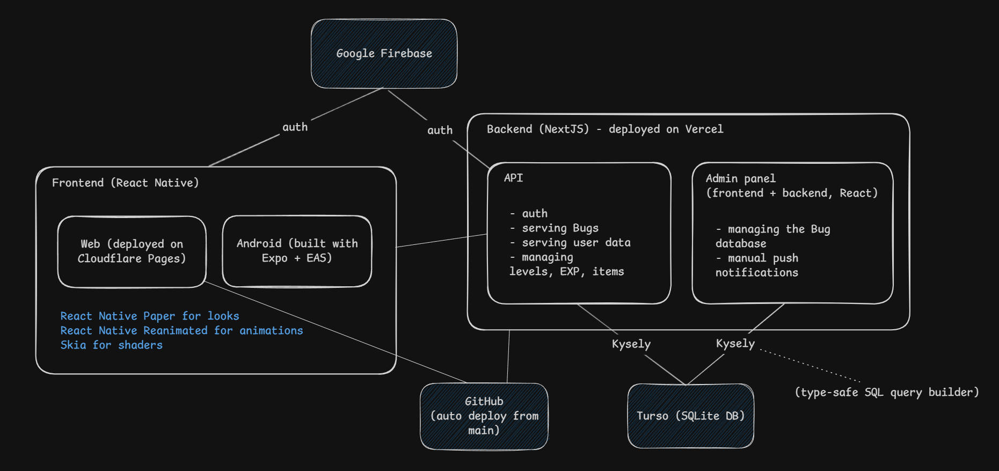

# Daily Bug

Daily Bug is a simple bug-spotting game which can help you **get better at code review**.

It keeps you playing with typical "gamification" features: levels, EXP and items obtainable through a [gacha](https://en.wikipedia.org/wiki/Gacha_game) system.

## Try it

### You can try the live web version [here](https://dailybug.pages.dev/)! Good luck!

## Showcase

<table>
  <tr>
    <td>
      
    </td>
    <td>
      
    </td>
    <td>
      
    </td>
  </tr>
</table>

(the GIFs may take a few seconds to load)

## Architecture overview



- **Frontend:** Expo + React Native
- **Backend:** Next.js
- **Auth:**
    - Firebase Auth (player side)
    - NextAuth / credentials (admin side)
- **Database:** Turso/libSQL
- **Deployment:** 
    - Cloudflare Pages (web frontend)
    - Vercel-compatible Next.js hosting (backend)
    - EAS Build (Android)

## Frontend - How to build & deploy

### Web

#### Development server

```sh
npx expo start --dev-client
```

#### Manual deploy to Cloudflare Pages:

```sh
npx expo export --platform web
npx wrangler pages deploy dist --project-name dailybug
```

### Android

#### Development server

```sh
npx expo start --dev-client
```

#### Development build with EAS

```sh
eas build --profile development --platform android
```

## Backend - How to build & deploy

#### Development server

```sh
npm run dev
```

#### Build

```sh
npm run build
```

## Configuration

This project has two apps (`frontend/` and `backend/`) and each one reads its own environment variables.

### Frontend (Expo)

The frontend uses only `EXPO_PUBLIC_*` variables.

`frontend/webpack.config.js` loads these variables from:

1. `frontend/.env.local` (first)
2. `frontend/.env` (fallback)
3. Existing OS/CI environment variables

Only variables starting with `EXPO_PUBLIC_` are injected into the app bundle.

#### Required frontend variables

Use `frontend/.env.example` as the template:

```env
EXPO_PUBLIC_FIREBASE_API_KEY=your_api_key
EXPO_PUBLIC_FIREBASE_AUTH_DOMAIN=your_project.firebaseapp.com
EXPO_PUBLIC_FIREBASE_PROJECT_ID=your_project_id
EXPO_PUBLIC_FIREBASE_STORAGE_BUCKET=your_project.appspot.com
EXPO_PUBLIC_FIREBASE_MESSAGING_SENDER_ID=your_sender_id
EXPO_PUBLIC_FIREBASE_APP_ID=your_app_id
EXPO_PUBLIC_API_URL=http://127.0.0.1:3000/api
```

`EXPO_PUBLIC_API_URL` should point to the backend API base URL.

#### Set frontend env locally

```sh
cd frontend
cp .env.example .env.local
```

Then edit `.env.local` with your Firebase and API values.

### Backend (Next.js)

The backend reads variables from `process.env` in code under `backend/lib` and `backend/app/api`.

For local development, create `backend/.env.local`.

#### Required backend variables

```env
# Turso / libsql database
DB_URL=libsql://your-db.turso.io
DB_TOKEN=your_turso_auth_token

# Firebase Admin SDK service account JSON (single-line JSON string)
FIREBASE_SERVICE_ACCOUNT_KEY={"type":"service_account",...}

# Admin sign-in password for /admin
ADMIN_SECRET=change_me

# Shared API secret checked by /api/bugs/all
API_SECRET=change_me_too

# Bearer secret for cron-like push endpoint auth
CRON_SECRET=change_me_again

# NextAuth secret (NextAuth is used for the admin panel auth)
NEXTAUTH_SECRET=generate_a_long_random_secret
```

#### Set backend env locally

Create `backend/.env.local` and paste the variables above.

If your Firebase credentials are in a file, convert them to one-line JSON before assigning to `FIREBASE_SERVICE_ACCOUNT_KEY`.

